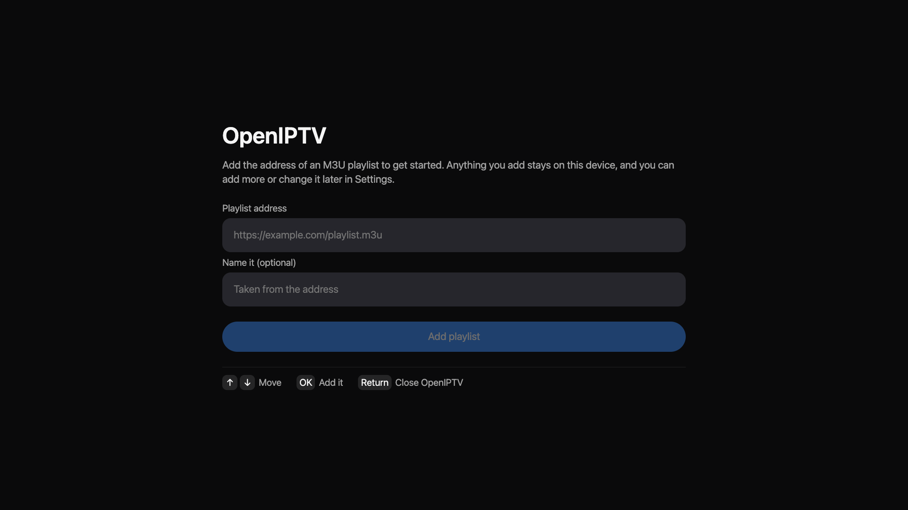
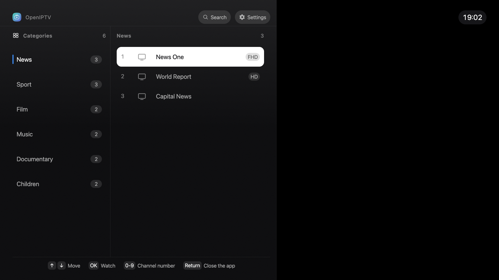
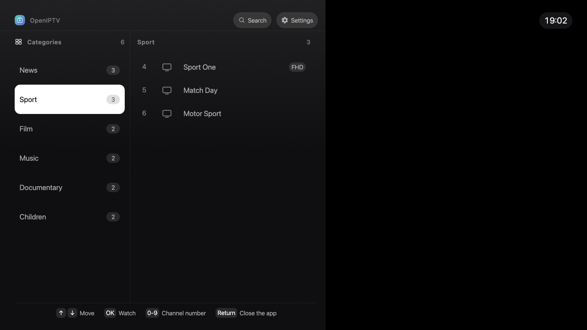
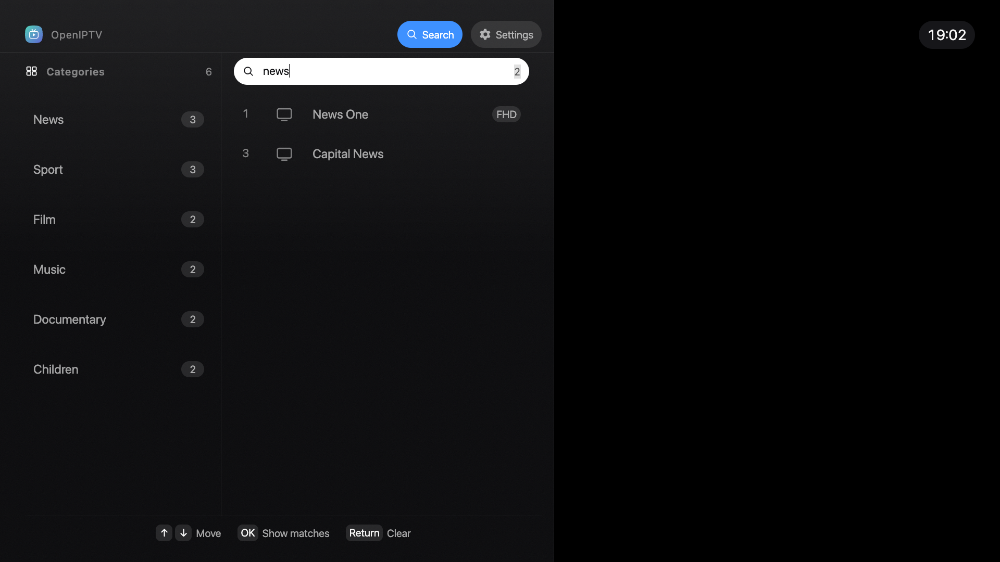
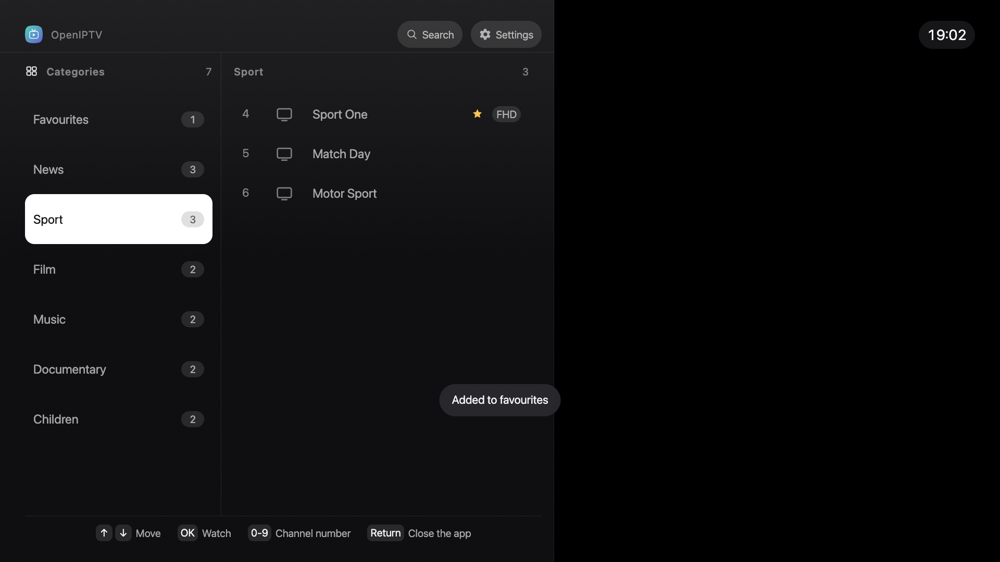
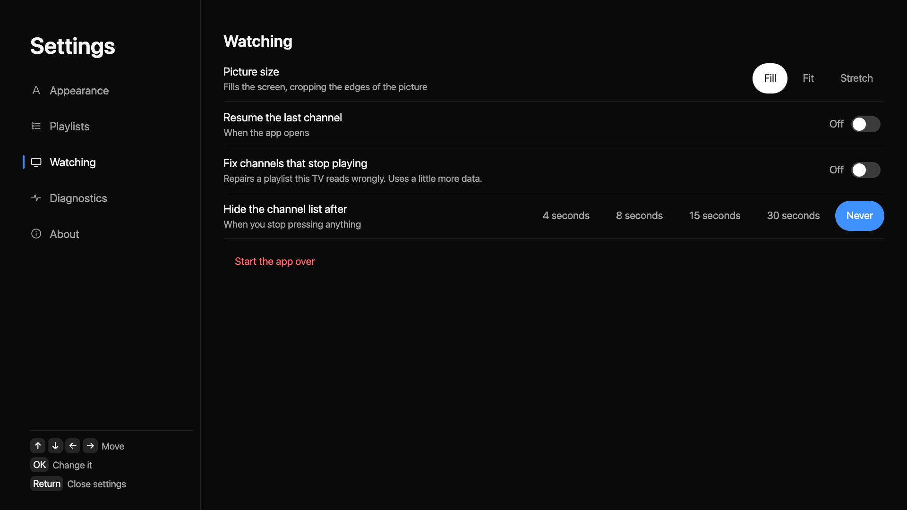

# OpenIPTV

[](https://github.com/shayanline/OpenIPTV/actions/workflows/ci.yml)

An IPTV player for Samsung TVs. Give it the address of an M3U playlist and it plays what is in it.

It comes with no channels of its own and reports nothing to anybody. It talks to the playlist and
the streams you point it at, and what you add stays on the television.

**[Try it in a browser](https://shayanline.github.io/OpenIPTV)**, the same build as the one on the
television. Arrow keys and Enter stand in for the D-pad and OK.

The [Samsung review demo playlist](https://shayanline.github.io/OpenIPTV/demo/nasa.m3u) contains
one NASA TV Public channel. It is published for certification testing and is not bundled with the
widget or loaded by the app by default.

## A look at it

|  |  |  |
|:--|:--|:--|
| [](docs/screenshots/01-first-run.png) | [](docs/screenshots/02-channels.png) | [](docs/screenshots/03-categories.png) |
| **Add** | **Watch** | **Browse** |
| [](docs/screenshots/04-search.png) | [](docs/screenshots/05-favourites.png) | [](docs/screenshots/06-settings.png) |
| **Search** | **Favourite** | **Adjust** |

## Disclaimer

This is a player, and it ships with nothing to play. No channel list, no playlist and no stream
address is bundled with it, and the project provides no content of any kind. What you see is
whatever the playlist you supply happens to contain.

The project is not affiliated with, endorsed by or connected to any broadcaster, channel or
streaming service. Please make sure you have the right to access whatever you add.

## What it does

- Plays any extended M3U playlist, in any language. Channel names appear exactly as the playlist
  writes them.
- Up and down change channel at the picture, in every state, including a channel that has failed.
- Keeps favourites, searches the whole playlist, and tunes to a channel number you dial.
- Comes back to the channel you were watching when you switch the television on.
- Holds as many playlists as you like and switches between them.
- Retries a broken channel three times on its own, then leaves it alone.

No guide, no recordings, no accounts.

## What you need

A Samsung TV from 2020 or later, which is Tizen 5.5 upwards. Or any current desktop browser.

## Install on a Samsung TV

Samsung ties app signing to the individual television, so a widget signed for one set is refused
by another with a certificate error. Each release attaches a built `OpenIPTV.wgt`, worth trying
if you already have a signing profile that covers your TV. Otherwise sign it yourself.

The TV has to be in developer mode either way:

1. Open Apps and press `12345` on the remote.
2. Turn Developer mode on and enter the IP address of the computer you will install from.
3. Restart the television. Port 26101 stays shut until it has restarted.

Then, with Samsung's Tizen CLI on that computer:

```bash
cd <wherever you downloaded the widget>     # -n takes a name, resolved from where you are
sdb connect <tv-ip>:26101
sdb devices                                # the third column is the name to install to
tizen install -n OpenIPTV.wgt -t "<name>"
```

The first launch asks for a playlist address and nothing else.

### Build and sign it yourself

You need Node 22.18 or newer and Tizen Studio, where the CLI alone is enough. In Certificate
Manager create an author certificate, then a Samsung distributor certificate for your own
television. Call the profile `OpenIPTV`, or set `SIGNING_PROFILE` to whatever you called it.

Three things about that certificate stop the process rather than warning you:

- The **Samsung** certificate type appears only once the Samsung Certificate Extension is
  installed, through the Tizen Studio Package Manager. The generic Tizen type signs without
  complaint and is then refused by a retail set at install.
- Creating the distributor certificate signs you in with a **Samsung account**.
- Your **television must be on, in developer mode and connected** at that moment, because that is
  when its identifier is read into the certificate.

```bash
git clone https://github.com/shayanline/OpenIPTV.git
cd OpenIPTV
npm ci
TV_IP=192.168.0.10 npm run deploy    # builds, signs, installs, launches
```

`npm run package` stops after writing `build/OpenIPTV.wgt`, for installing by hand.

### Install through TizenBrew Installer Desktop

[TizenBrew Installer Desktop](https://github.com/reisxd/TizenBrewInstaller/releases/latest) can fetch the latest widget from this repository and install it on a television in developer mode.

1. Connect the television to the installer and enable developer mode.
2. Enter `shayanline/OpenIPTV` as the GitHub repository.
3. Let the installer create or select Samsung certificates when it asks. On Tizen 7 or later, it resigns the widget for the connected television before installing it.
4. Launch OpenIPTV from the television's app list.

The installer selects the first `.wgt` or `.tpk` file in the latest GitHub release. Every tagged release from this repository publishes `OpenIPTV.wgt`.

On TVs before Tizen 7, the installer uses the released signature without creating a new one. The released widget is signed for the television used to produce that release, so another television needs a local build and a Samsung distributor certificate. Follow the manual build instructions above when that applies.

## Watch in a browser

[shayanline.github.io/OpenIPTV](https://shayanline.github.io/OpenIPTV) is the latest release.
Nothing is installed and nothing is sent anywhere: the playlist you add is held in your own
browser.

Or run it from source, which is the same thing:

```bash
npm ci
npm run dev      # then open the address it prints
```

Playback in a browser goes through hls.js instead of the TV's own decoder, so a stream whose host
refuses cross origin requests fails here and plays perfectly well on the set. The hosted page is
also served over https, so a playlist or a stream at a plain `http` address is blocked as mixed
content before it reaches the app. Neither `npm run dev` nor a television is subject to that.

## Your playlist

Any extended M3U over http or https. OpenIPTV reads `tvg-id`, `tvg-name`, `tvg-logo`,
`group-title` and `tvg-quality`, groups channels by `group-title` in the order the file
introduces them, and interprets nothing else. Channels with no group go to Uncategorised.

A copy is kept on the television for six hours, so switching on does not wait for a download.
Settings, then Playlists, then Refresh now, ignores that and fetches again.

## The remote

| Key | Watching | In the channel panel | Searching |
|:--|:--|:--|:--|
| Up, Down | Previous and next channel | Move through the list | Between the field and the results |
| Left | Open the channel panel | Out to the rail, then out of the panel | Move the caret |
| Right | Hide the banner | Further in, and plays the channel at the last stop | Move the caret |
| OK | Pause and resume | Play the highlighted channel | Show the matches, then play one |
| Return | Open the channel panel | Step back, then offer to close the app | Clear, then leave the search |
| Ch+, Ch- | Previous and next channel | Previous and next channel | Previous and next channel |
| 0-9 | Tune to a channel number | Tune to a channel number | Type a digit |
| Green | Favourite | Favourite | Favourite |
| Yellow | Settings | Settings | Settings |

Search and Settings sit in the panel's title bar, one press up from the first category.

Play, Pause, Stop and the track keys work wherever you are. Resuming from a pause rejoins the
broadcast rather than continuing from where you stopped, because live television has moved on.

## Settings

The yellow key, from anywhere.

- **Appearance**: text size, channel numbers, logos, clock, sorting.
- **Playlists**: add, edit, remove, switch, refresh.
- **Watching**: picture size, resuming, sorting A to Z, compatibility mode, how long the channel
  list stays open.
- **Diagnostics**: what this television is, and every key its remote sends.
- **About**: version, and where to find the source.

## When something does not work

- **A channel will not play.** It retries after 4, 8 and 15 seconds and then stops. Press down
  for the next one, which works even while the fault is on screen.
- **The install fails with a certificate error, 118 or -12.** The distributor certificate is not
  issued for this television. See the signing note above.
- **A coloured key does nothing.** Settings, then Diagnostics, lists every key press the app
  receives. A button missing from that list never reached the app, so the set is keeping it.
- **A channel shows a picture for a moment and then stops.** Turn on Compatibility mode in
  Watching. Some channels publish a playlist this player reads incorrectly, and the app can
  serve it a corrected copy. Leave it off otherwise, because while it is on the app fetches those
  playlists itself and uses a little more of your connection.
- **Logos are slow to appear.** Turn Channel logos off in Appearance.
- **A stream plays on the TV but not in a browser.** The host is refusing cross origin requests.
  There is nothing to fix in the app.

## Contributing

Issues and pull requests are welcome. Run `npm run check` before opening one.
[CONTRIBUTING.md](CONTRIBUTING.md) has the rest, [the design notes](docs/design.md) explain why the
interface is shaped the way it is, and [the testing notes](docs/testing.md) cover what runs against
the televisions nobody here owns.

## Licence

MIT, in [LICENSE](LICENSE). The projects that travel inside the built application are listed in
[THIRD-PARTY-NOTICES.md](public/THIRD-PARTY-NOTICES.md), with their licence texts beside it.
