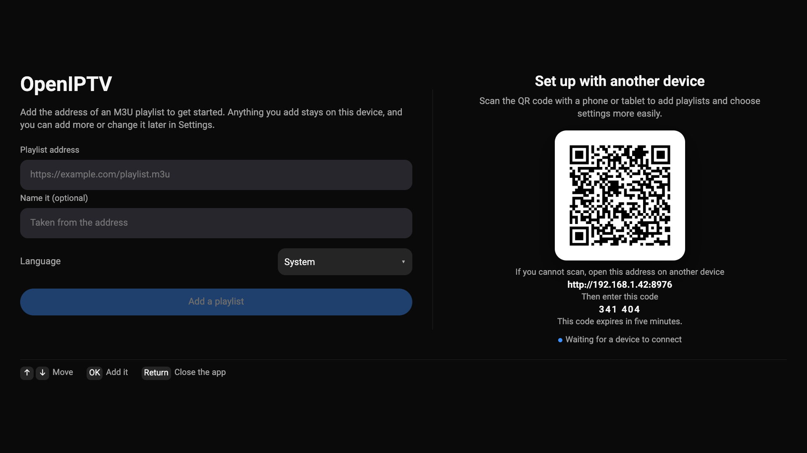
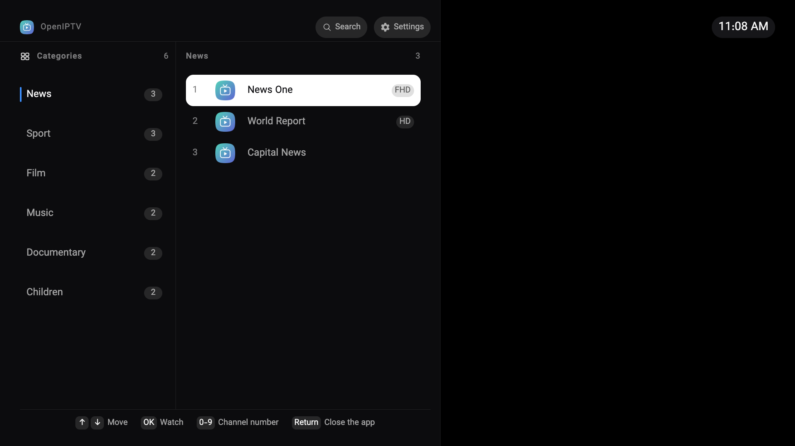
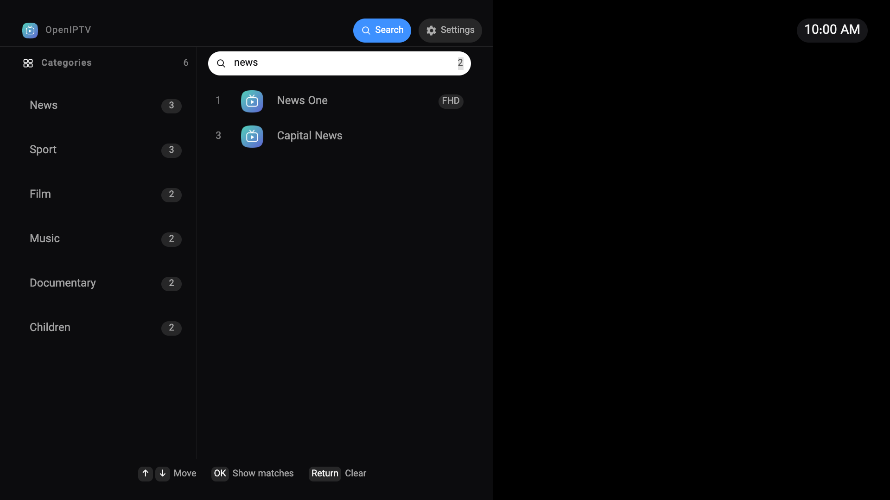
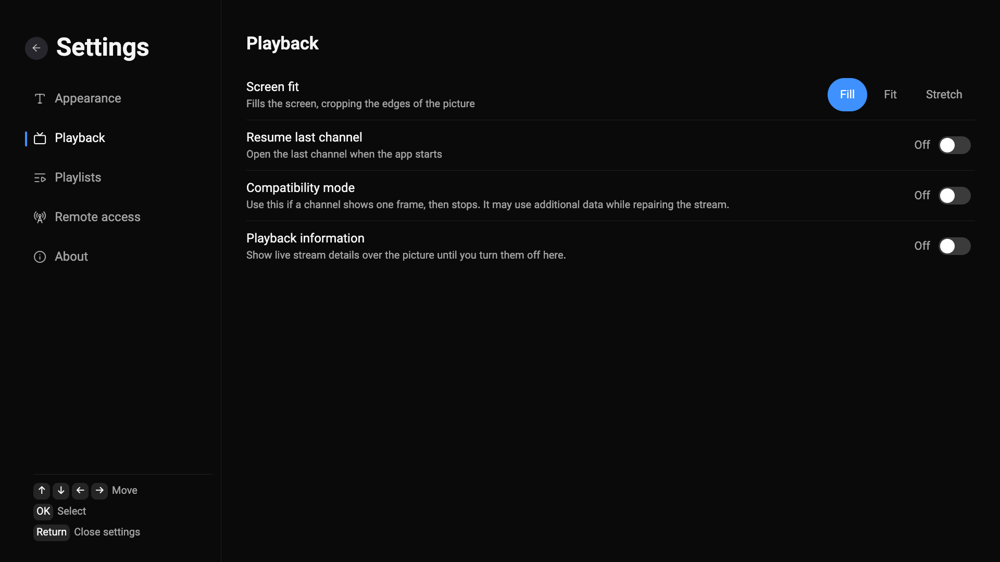
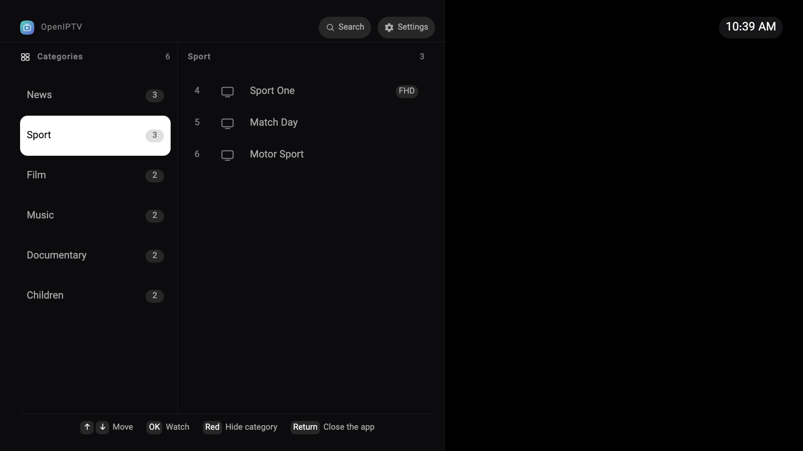
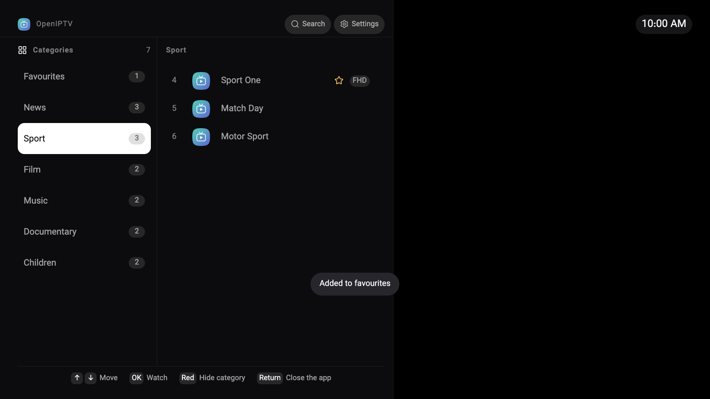
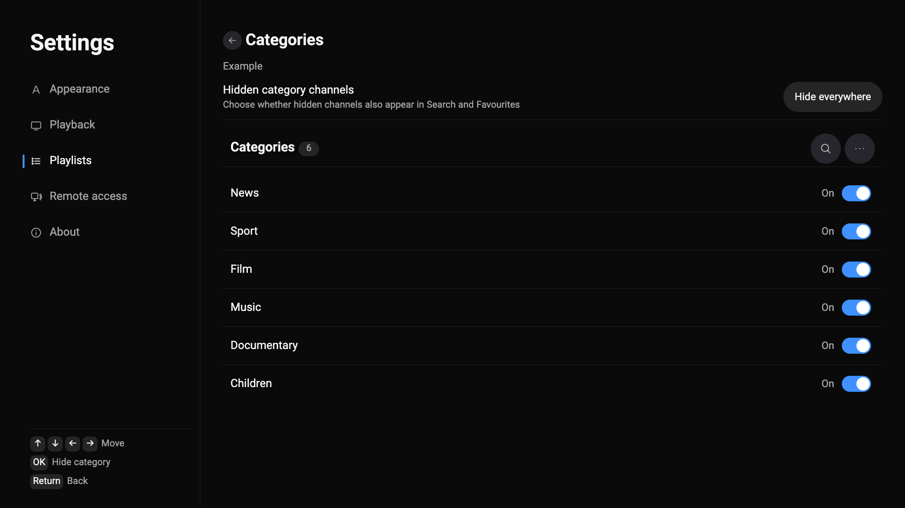
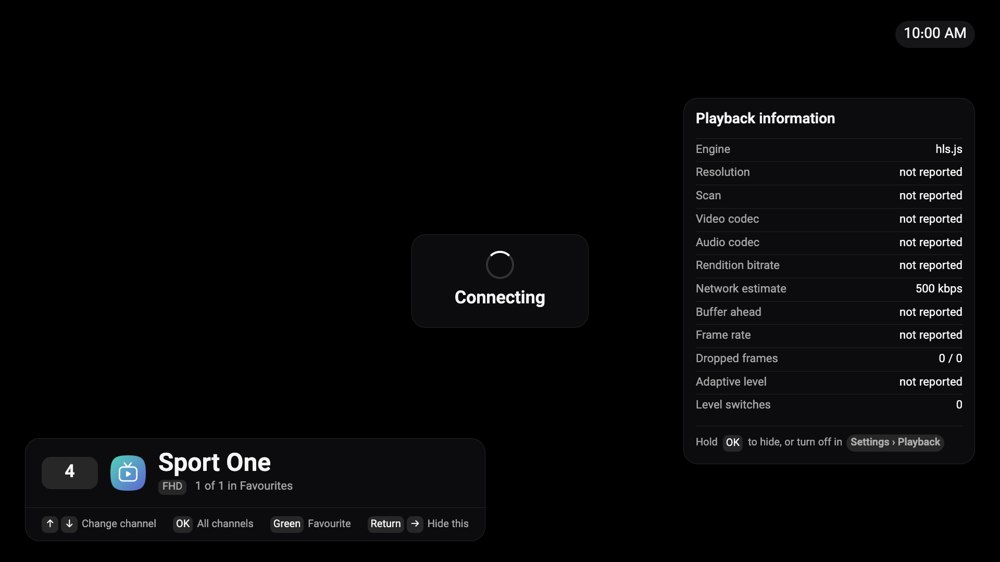
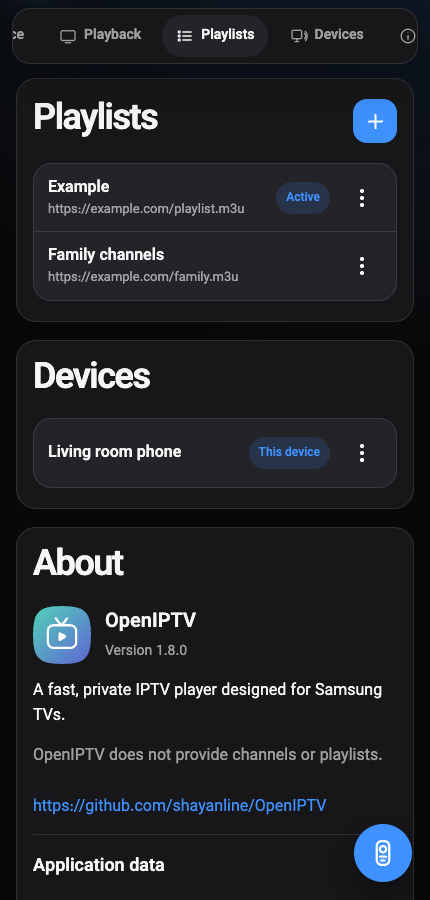
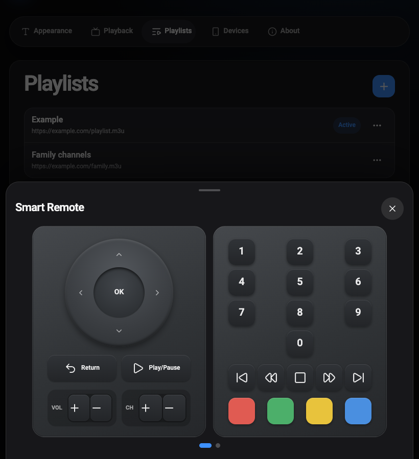

#  OpenIPTV

[](https://github.com/shayanline/OpenIPTV/actions/workflows/ci.yml)
[](https://github.com/shayanline/OpenIPTV/releases/latest)
[](https://github.com/shayanline/OpenIPTV/releases)
[](LICENSE)
[](https://developer.samsung.com/smarttv/develop/specifications/tv-model-groups.html)
[](https://nodejs.org/)

OpenIPTV is a private, open source IPTV player for Samsung TVs. Add an [extended M3U playlist or Xtream login](#add-playlists), then browse and play your channels through an interface designed for the television.

Your playlists, preferences, and favourites stay on your device. OpenIPTV has no accounts, analytics, advertising, or project operated service.

> [!TIP]
> **[Try OpenIPTV in your browser](https://shayanline.github.io/OpenIPTV).** Use the arrow keys and Enter as the directional pad and OK button. If you need a sample, copy the address of the [demo playlist](https://shayanline.github.io/OpenIPTV/demo/nasa.m3u) into the playlist field.

> [!IMPORTANT]
> OpenIPTV is a player and provides no channels or other content. The project is not affiliated with any broadcaster, channel, streaming service, or playlist provider. Make sure you have the right to access what you add.

## See OpenIPTV

### On the television

|  |  |
|:--|:--|
| [](docs/screenshots/01-first-run.png) | [](docs/screenshots/02-channels.png) |
| [**Set up OpenIPTV**](#add-playlists) | **Browse channels** |
| [](docs/screenshots/04-search.png) | [](docs/screenshots/06-settings.png) |
| **Search channels** | **Change Playback settings** |

<details>
<summary>More television screenshots</summary>

|  |  |
|:--|:--|
| [](docs/screenshots/03-categories.png) | [](docs/screenshots/05-favourites.png) |
| [**Browse Categories**](#add-playlists) | **Add channels to Favourites** |
| [](docs/screenshots/07-category-management.png) | [](docs/screenshots/08-playback-information.png) |
| [**Manage Categories for a playlist**](#add-playlists) | **View Playback information** |

</details>

### Remote access on a phone

|  |  |
|:--:|:--:|
| [](docs/screenshots/09-remote-access.png) | [](docs/screenshots/10-smart-remote.png) |
| [**Manage OpenIPTV from another device**](#remote-access) | [**Use every Smart Remote control**](#remote-button-reference) |

## What you can do

- Browse original playlist categories, manage their visibility, and keep Favourites.
- Search every channel or tune directly with channel numbers.
- Resume the last channel and inspect live playback information.
- Use 17 translated interfaces, including complete right to left layouts for Arabic and Persian.

OpenIPTV focuses on live viewing, without a programme guide or recording features.

## Install on a Samsung TV

OpenIPTV supports Samsung TVs from 2020 onwards, running Tizen 5.5 or later. The television and computer used for installation must share the same local network.

> [!TIP]
> **[TizenBrew Installer Desktop](#install-with-tizenbrew) is the easiest installation route.** It downloads the latest OpenIPTV release and guides you through installation.

### Prepare the television

1. Open Apps and press `12345` on the remote.
2. Turn Developer mode on and enter the computer's IP address.
3. Restart the television.

### Install with TizenBrew

1. Open [TizenBrew Installer Desktop](https://github.com/reisxd/TizenBrewInstaller/releases/latest).
2. Enter the television's IP address from its Network Status screen and connect.
3. Enter `shayanline/OpenIPTV` as the GitHub repository.
4. Follow the certificate prompts, install OpenIPTV, and launch it from the television application list.

> [!NOTE]
> Tizen 7 and later can resign the released widget for the connected television. Earlier versions may need a [locally signed build](#build-and-sign-manually).

### Build and sign manually

<details>
<summary>Show manual build instructions</summary>

Install Node 22.18 or later and Tizen Studio. In Certificate Manager, create an author certificate and a Samsung distributor certificate for your television. Install the Samsung Certificate Extension, sign in with a Samsung account, and keep the television on and connected while creating the certificate.

Call the signing profile `OpenIPTV`, or set `SIGNING_PROFILE` to its name.

```bash
git clone https://github.com/shayanline/OpenIPTV.git
cd OpenIPTV
npm ci
TV_IP=192.168.0.10 npm run deploy
```

Run `npm run package` when you only need `build/OpenIPTV.wgt`.

</details>

## Add playlists

| Source | What to enter |
|:--|:--|
| **Extended M3U** | A complete HTTP or HTTPS playlist address. |
| **Xtream login** | The server address, username, password, and HLS or MPEG TS stream format. |

Save several playlists and activate one at a time. Each playlist keeps its own category visibility, and password values stay concealed in the interface.

## Remote access

Remote access is available from the first run screen or Settings, then Remote access. Keep OpenIPTV open and connect a phone or tablet to the same trusted local network, then scan the QR code or enter the displayed address and pairing code.

A paired device can manage playlists, ordinary settings, application data, authorised devices, and playback. [Smart Remote](#remote-button-reference) provides navigation, number, colour, channel, volume, and playback controls.

### Remote button reference

<details>
<summary>Show remote controls</summary>

| Key | Watching | Channel panel | Search |
|:--|:--|:--|:--|
| <kbd>↑</kbd> <kbd>↓</kbd> | Change channel | Move through the list | Move between the field and results |
| <kbd>←</kbd> | Open the channel panel | Move toward Categories, then close the panel | Move the caret |
| <kbd>→</kbd> | Hide the title badge | Move toward channels, then play | Move the caret |
| <kbd>OK</kbd> | Open the channel panel | Play the highlighted channel | Show matches, then play |
| Hold <kbd>OK</kbd> | Toggle Playback information | No action | No action |
| <kbd>Return</kbd> | Close the visible layer | Go back | Clear Search, then close it |
| <kbd>Ch+</kbd> <kbd>Ch-</kbd> | Change channel | Change channel | Change channel |
| <kbd>0</kbd> to <kbd>9</kbd> | Tune to a channel number | Tune to a channel number | Type a digit |
| <kbd>Green</kbd> | Toggle Favourites | Toggle Favourites | Toggle Favourites |
| <kbd>Red</kbd> | No action | Change category visibility | No action |
| Hold <kbd>Red</kbd> | No action | Show or conceal hidden categories | No action |
| <kbd>Yellow</kbd> | Open Settings | Open Settings | Open Settings |

<kbd>Play</kbd>, <kbd>Pause</kbd>, <kbd>Stop</kbd>, and the track keys work throughout the app.

</details>

## Help

> [!NOTE]
> Browser security can prevent some providers from playing through the hosted demo even when the same stream works on the television.

<details>
<summary>Common issues</summary>

- **TizenBrew cannot connect.** Repeat [Prepare the television](#prepare-the-television), including the restart, and avoid guest networks that isolate devices.
- **Installation reports certificate error 118 or -12.** Follow [Build and sign manually](#build-and-sign-manually).
- **A playlist address is refused.** Review the supported details under [Add playlists](#add-playlists).
- **An Xtream channel will not play.** Try the other stream format under [Add playlists](#add-playlists).
- **A channel shows one frame and stops.** Turn on Compatibility mode under Settings, then Playback.
- **A remote key does nothing.** Open Settings, About, Support, Diagnostics, then Remote buttons, then compare it with the [remote button reference](#remote-button-reference).
- **Logos are slow to appear.** Turn Show channel logos off under Settings, then Appearance.

</details>

## Contributing

Issues and pull requests are welcome. Read [CONTRIBUTING.md](CONTRIBUTING.md) for the development workflow, [the design notes](docs/design.md) for interface decisions, and [the testing notes](docs/testing.md) for compatibility checks. Report security problems through [SECURITY.md](SECURITY.md).

## Licence

OpenIPTV uses the MIT licence in [LICENSE](LICENSE). Runtime projects included in the application are listed in [THIRD-PARTY-NOTICES.md](public/THIRD-PARTY-NOTICES.md).
